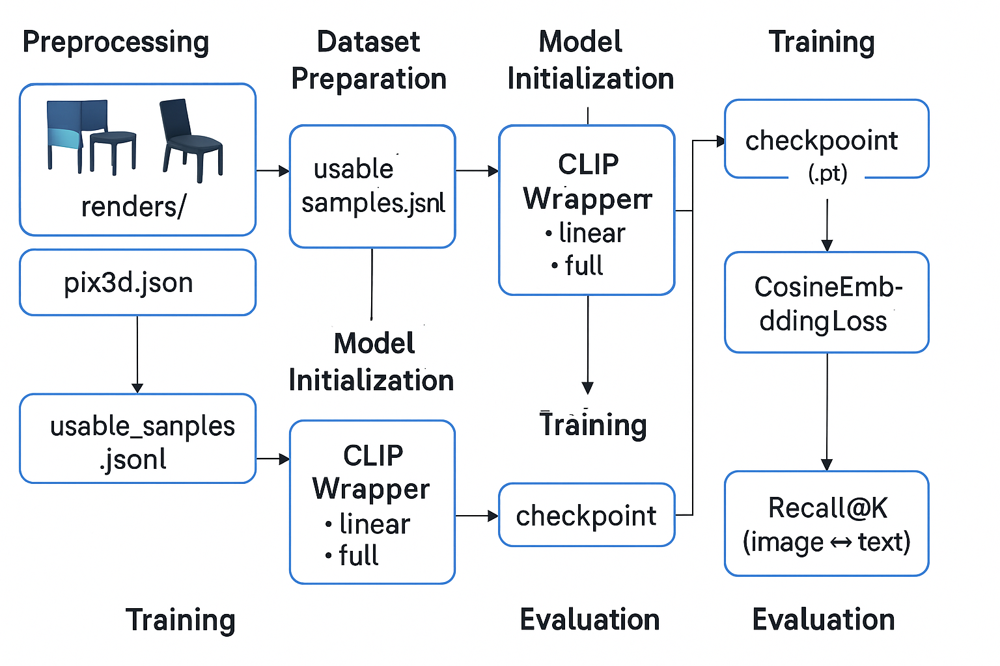

# CLIP-Based Image Captioning and Retrieval from 3D Meshes  
*A Unified Framework for Multi-View Vision-Language Learning using Pix3D*

---

##  Overview

This project explores a **vision-language framework** that bridges **3D mesh data** and **natural language**, focusing on **image captioning** and **cross-modal retrieval** using **CLIP**. Specifically, we render **multi-view 2D images** from **3D object meshes (Pix3D dataset)**, and fine-tune a CLIP model to align the visual and textual modalities.

**Key Contributions:**
- Rendering pipeline for generating 2D views from 3D `.obj` files.
- A modular `CLIPWrapper` enabling both **linear probing** and **full fine-tuning**.
- Support for **captioning**, **image-to-text**, and **text-to-image retrieval** tasks.
- Evaluation with **Recall@K**, **BLEU**, and **METEOR**.
- Integrated **TensorBoard logging** and **checkpoint saving**.

---

## Project Structure

```bash
CLIP-Captioning-from-3D/
│
├── models/
│   └── clip_wrapper.py          # CLIP wrapper with flexible training modes
│
├── data/
│   └── pix3d/                   # Pix3D dataset (images, masks, .obj, json)
│       ├── usable_samples.jsonl
│       ├── renders/             # Rendered views from .obj models
│
├── scripts/
│   ├── render_objs.py           # Generate multi-view renders
│   └── generate_jsonl.py        # Convert annotations to JSONL
│
├── train.py                     # Unified training script
├── train_clip_linear.py         # Train linear projection on CLIP
├── train_clip_full.py           # Fine-tune all CLIP parameters
│
├── eval_recall.py               # Evaluate Recall@K retrieval
├── evaluate_caption.py          # Evaluate BLEU and METEOR
├── run.py                       # Unified runner
│
├── multiview_dataset.py         # Custom dataset class
├── utils.py                     # Utilities: preprocessing, tokenizer, etc.
│
├── logs/                        # TensorBoard logs
├── weights/                     # Saved model checkpoints
│
└── README.md 
```
##  Installation
```bash
# Clone repository
git clone https://github.com/hoangphuu/CLIP-Captioning-from-3D.git
cd CLIP-Captioning-from-3D

# Install dependencies
pip install -r requirements.txt
```
Required packages:

- torch, torchvision
- openai-clip
- trimesh, Pillow, tqdm
- nltk, scikit-learn

## Data Preparation
1. Download Pix3D dataset from : Github
2. Place the dataset in the following format:
```bash
data/pix3d/
├── model/         # .obj 3D models
├── image/         # RGB images (optional)
├── mask/          # segmentation masks (optional)
├── pix3d.json     # metadata
```
3. Genarate JSONL file with usable entries:
```bash
python scripts/generate_jsonl.py --json_path data/pix3d/pix3d.json
```
4. Render .obj into multi-view 2D images:

```bash
Copy code
python scripts/render_objs.py --obj_dir data/pix3d/model --output_dir data/pix3d/renders
```
## Training
### Linear Probing
```bash
python train_clip_linear.py 
```
### Full Fine-tuning
```bash
python train_clip_full.py
```
Training hyperparameters (e.g., batch size, learning rate, epochs) can be configured in the script or passed via argparse.

## Evaluation
###  Retrieval (Recall@K)
```bash
python eval_recall.py
```
### Captioning (BLEU, METEOR)
```bash
python evaluate_caption.py
```
## TensorBoard Logging
Logs are saved under logs/. To visualize training metrics:

```bash
tensorboard --logdir logs/
```
## Architecture Diagram
```bash
          +----------------+         +--------------------+
          |   3D Model     |         |   Text Caption     |
          |   (.obj file)  |         |  (e.g. "a brown bed")|
          +--------+-------+         +--------+-----------+
                   |                           |
                   v                           v
        +----------+--------+        +---------+-----------+
        |  Renderer (multi-view) |   |  CLIP Text Tokenizer |
        +----------+--------+        +---------+-----------+
                   |                           |
                   v                           v
          +--------+--------+        +---------+-----------+
          | CLIP Image Encoder|      |  CLIP Text Encoder  |
          +--------+--------+        +---------+-----------+
                   \_______________________/
                            |
                            v
             +--------------+----------------+
             |   Contrastive Loss (CLIP)     |
             +------------------------------+
```
## References
- Radford et al. (2021) Learning Transferable Visual Models From Natural Language Supervision (CLIP)

- Sun et al. (2018) Pix3D: Dataset and Benchmark for 3D Shape Understanding from a Single Image

- HuggingFace Transformers: https://github.com/huggingface/transformers
